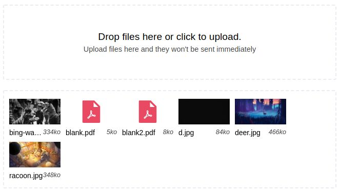

# Customized built-in elements `is="drop-files"`

[](http://npm.im/@grafikart/drop-files-element)
[](https://travis-ci.org/Grafikart/CustomElement-DropFiles)

The goal of this module is to add user interaction on a file input with multiple files as a progressive enhancement (the form still works if this JavaScript is disabled)



## Usage

### With npm

Install the package using npm or yarn

```bash
npm i @grafikart/drop-files-element
# or
yarn add @grafikart/drop-files-element
```

Then import it in your script

```js
import '@grafikart/drop-files-element'
```

### With unpkg.com

```html
<script type="module" src="//unpkg.com/@grafikart/drop-files-element"></script>
```

Then use the custom element in your html using `is="drop-files`.

```html
<input
        type="file"
        multiple
        name="files[]"
        label="Drop files here or click to upload."
        help="Upload files here and they won't be sent immediately"
        is="drop-files"
/>
```

### Safari

Unfortunately safari doesn't support Custom build-in elements and you have to polyfill this feature at the moment using [@ungap polyfill](https://github.com/ungap/custom-elements-builtin)

```html
<script src="https://unpkg.com/@ungap/custom-elements-builtin"></script>
```

## Customization

### Attributes

| Attribute | Type     | Description                                          |
|-----------|----------|------------------------------------------------------|
| `label`   | `string` | The label used as a bold text for the drop area      |
| `help`   | `string` | Help text used as a secondary text for the drop area  |

### CSS Custom Properties

| Property                    |
|-----------------------------|
| `--drop-border-color`       |
| `--drop-border-color-hover` |

### HTML Structure

This component doesn't use shadow dom so you can customize the style using CSS and overwrite the style already included inside this custom element.
